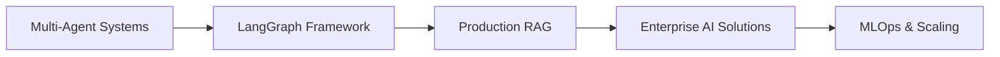

# Hi there, I'm Pritam Patil! 👋

<div align="center">
  
</div>

## 🚀 About Me

```python
class PritamPatil:
    def __init__(self):
        self.role = "AI Engineer"
        self.current_company = "Upstage AI"
        self.specializations = [
            "LangGraph Multi-Agent Systems",
            "Production RAG Pipelines", 
            "AWS MLOps",
            "Generative AI Applications"
        ]
        self.passion = "Building AI systems that solve real-world problems"
        self.current_focus = "Multi-agent orchestration & enterprise AI solutions"
        
    def get_achievements(self):
        return {
            "accuracy_improvement": ">95% in classification systems",
            "cost_reduction": "85% through serverless deployments",
            "processing_scale": "1,000+ PDFs daily with >1TB throughput",
            "integration_speedup": "60% faster AI integrations"
        }
```

## 🛠️ Tech Stack & Tools

### Languages & Frameworks


### AI/ML & Data


### Cloud & DevOps


### Databases & Tools


## 🌟 Featured Projects

### 🎙️ [AI Podcast Generator](https://github.com/PritamPatil2603/podcast-creator-ai)
> Multi-Agent Orchestration System using LangGraph

- **Impact**: Reduced production time from 4+ hours to 5 minutes
- **Tech**: LangGraph, Gemini 2.5 Flash, Docker, Google Cloud Run
- **Scale**: 99.9% uptime with <30-second response times

### 🏥 [AI Voice Agent for Healthcare](https://futureaichatbot.com)
> Intelligent appointment booking and customer support

- **Impact**: 500+ monthly bookings, 25% reduction in no-shows  
- **Tech**: GPT-4, Claude 3.5 Sonnet, ElevenLabs, Twilio
- **Performance**: Sub-2-second response latency

### 🔧 [Upstage MCP Server](https://github.com/PritamPatil2603/upstage-mcp-server)
> Model Context Protocol server for Claude Desktop integration

- **Impact**: 60% faster AI integrations, 95% parsing accuracy
- **Tech**: Python, AsyncIO, Pydantic, GitHub Actions
- **Distribution**: Published on PyPI with automated CI/CD

## 📊 GitHub Analytics

<div align="center">
  
  
</div>

<div align="center">
  
</div>

## 🏆 Experience Highlights

**🔥 Current:** AI Engineer at **Upstage AI** (Mar 2025 - Present)
- Building production-grade MCP servers and RAG systems
- Achieving 95%+ accuracy in document processing pipelines

**⚡ Previous:** Gen AI & ML Engineer at **Accenture** (Apr 2022 - Mar 2025)  
- Led LangGraph multi-agent systems for enterprise clients
- Deployed AWS infrastructure processing >1TB monthly throughput

## 🎓 Certifications & Education

- 🏅 **AWS Certified Machine Learning – Specialty**
- 🧠 **AI Agents in LangGraph** (DeepLearning.AI)
- 🎓 **BTech** from Institute of Chemical Technology (2021)

## 📈 Current Focus



- 🔬 Researching advanced multi-agent architectures
- 🚀 Building production-ready AI systems
- 📚 Contributing to open-source AI tools
- 🌐 Exploring AI ethics and responsible deployment

## 🤝 Let's Connect!

<div align="center">

[](https://linkedin.com/in/pritam-patil-0a6552166/)
[](mailto:pritam1998patil@gmail.com)
[](https://github.com/PritamPatil2603)

</div>

---

<div align="center">
  
</div>

<div align="center">
  <h3>💭 "Building the future, one AI agent at a time"</h3>
</div>
